# Clion Usage Guide

This guide tell you about basic usage of Clion. 

If you cannot see the pictures clearly, try to goto [this page]()

Before you start this guide, make sure you have 

* Installed Clion correctly.
* Successfully get a student license. (Or you have the cracked version of the software)

## Tool chain setup:

You are about to tell Clion where `gcc` is. 

* Close your current project 
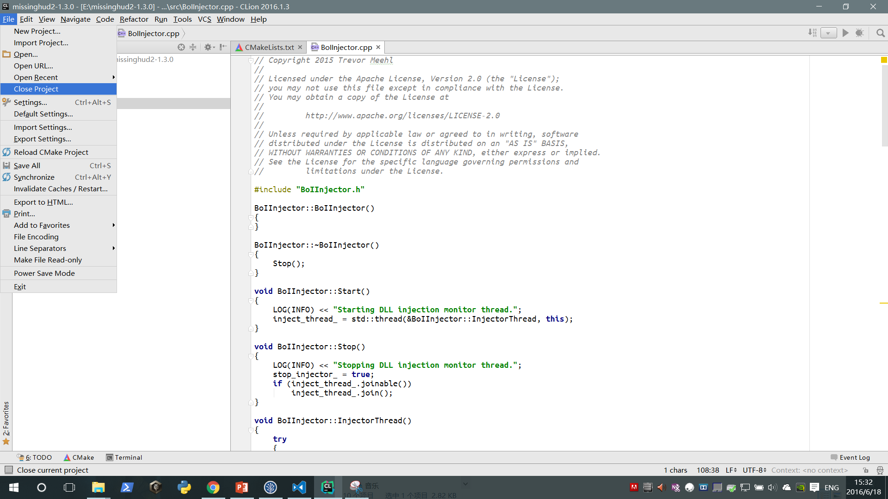

* In the welcome screen choose settings.
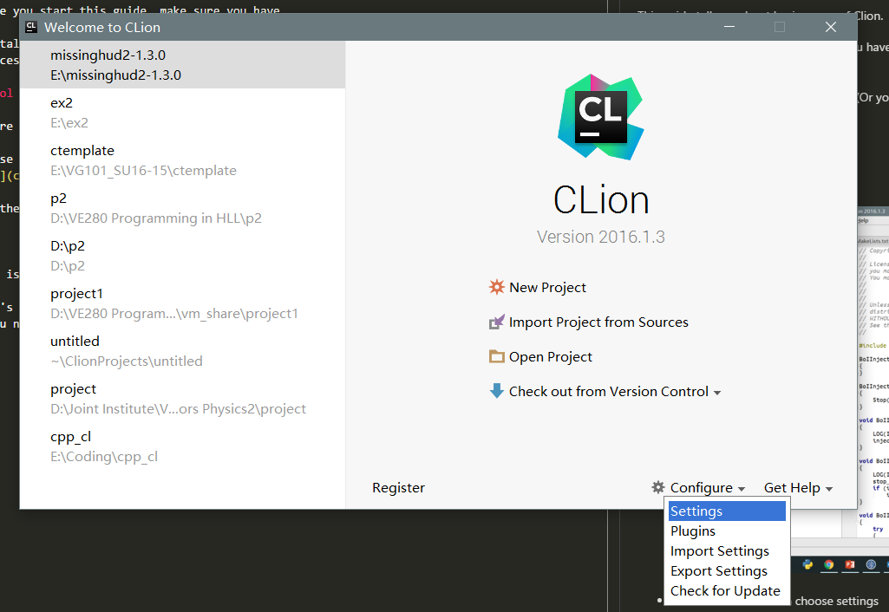

* In the popup settings window, goto `toolchain`
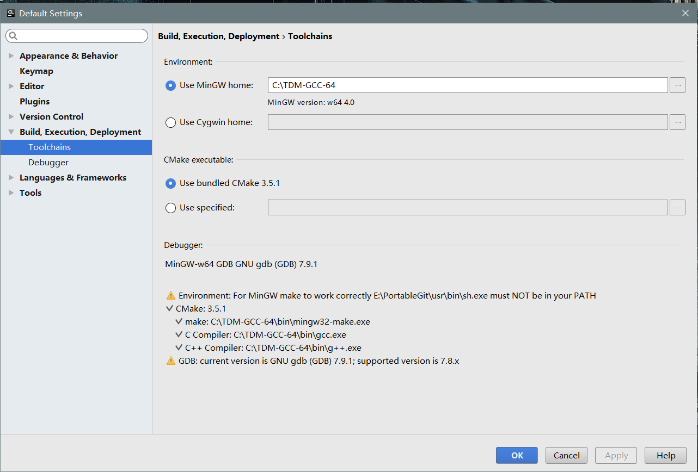

* Keep others as they are, in `Environment/Use MinGW home`, chose your `gcc` installation dir

If you follow the instruction. The default dir should be (Mine is a little bit different):
```
C:\TDM-GCC-32
```


* Wait some time for the software to verify your choice of location.

 Normally you would get a warning, nerver mind. Just click OK

You have sucessfully set up `gcc`

## The first project

* Click new project on the welcome screen. Enter your project name and place. Click OK. 

  **You must choose a place that does not contain non-english character in its path!**


* You will see a screen like this. Notice the words and progress bar in the red box.
  
  It indicates CLion is trying to process your code (And Environment). It takes time (depends on your CPU,
  and how large your program is). You can write code in this period. But you cannot compile anything yet. 
  
  This will happen only at:

  1. You just opened your project
  2. You added (deleted) files to compile in your project.

  Wait patiently. The time is worthy. 

  By default, Clion considers itself a C++ IDE. Meaning it automatically generate a C++ sample file.

  Notice the file extention for this file is ".cpp".

  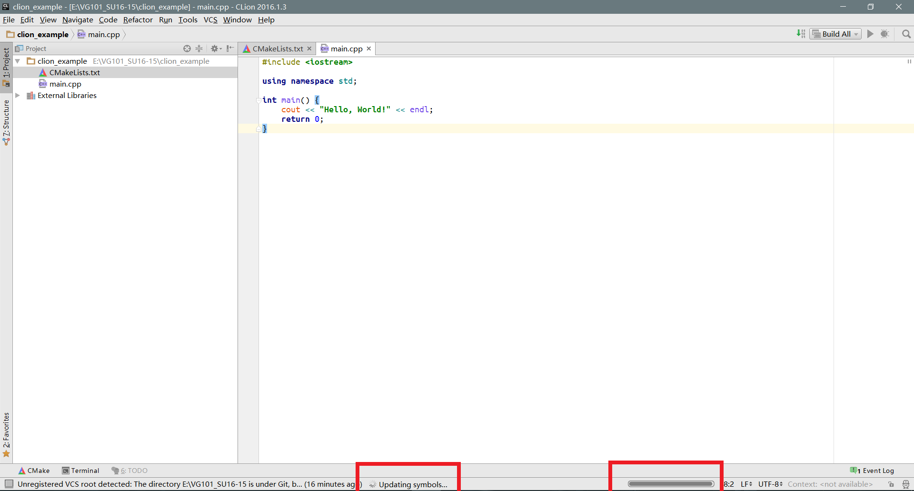

* Adding/Deleting file to compile
  
  We now need to delete the ".cpp" file. This is done by editing the "CMakeLists.txt". 

  The "CMakeLists.txt" contains a list of files that will be compiled by the compiler. 

  Double click "CMakeLists.txt" (This file has a triangle icon on the left) to open it. 

  

  Change the line `set(SOURCE_FILES main.cpp)` into 
```
set(SOURCE_FILS )
```
  As the name suggests, this deletes main.cpp from the list of source files that will be compiled.

  If the yello bar above appears, clik the red boxed one. Wait until Clion processed the change.
  Ignore any error. Now you should delete this file (physically, or in other words, delete in Windows).

  Then we add our own C file. Right click on the project folder any click `new/new C/C++ source file`
  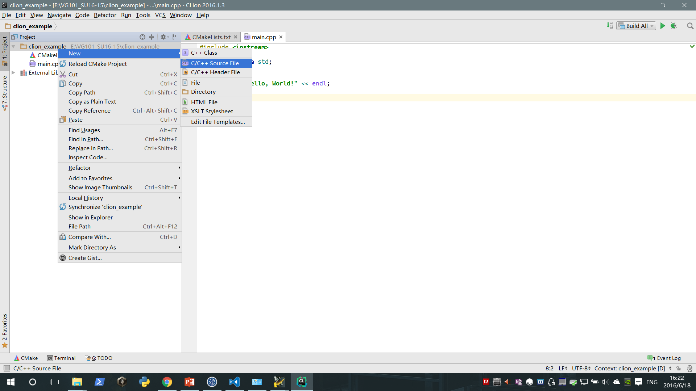

  In the pop up windows, in type select `.C`. This means it is a C Source file. Let's name it `main`.  Click OK
  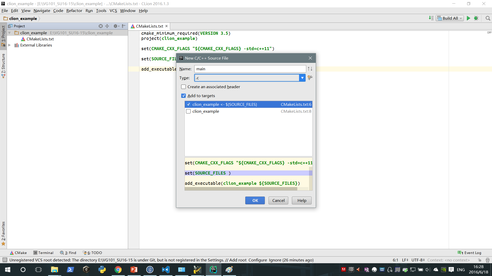

  Check again the `CMakeLists.txt`, you see `main.c` in `set(SOURCE_FILE main.c)`. 
  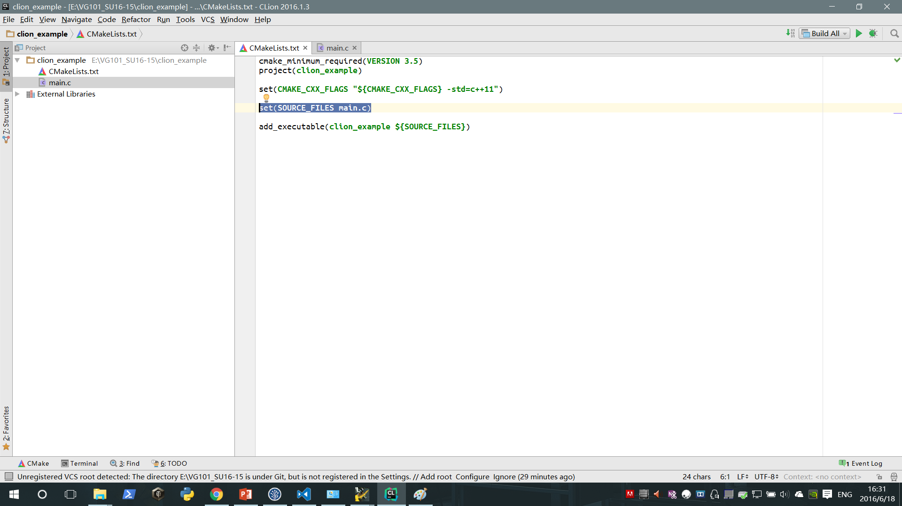

  This means the sofware automatically added your new source file in to the list of file to compile

  **IMPORTANT**

  If you want to add existing file to your homework. Do this by
  
  1. copy the file to your project directory
  2. Add the file into `set(SOURCE_FILE ...)` in `CMakeLists.txt`

* Now you can open your `main.c`, write the hello world program.

```c
#include <stdio.h>

int main() {
    printf("Hello World\n");
    return 0;
}
```

  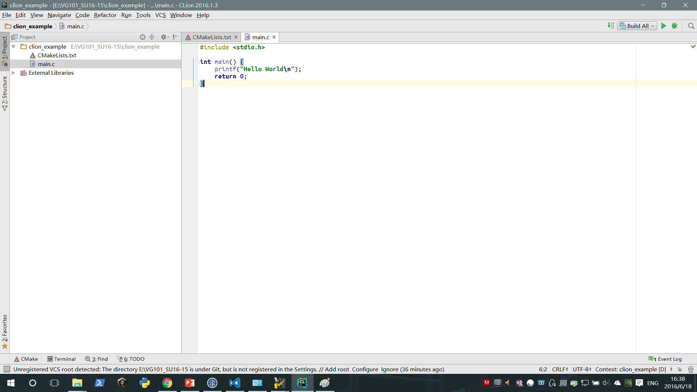
  
  Notice how CLion hightlights the `"Hello world\n"`. 
  It recogonized `\n` as a special character, thus notifying the programmer.
  These kind of design eventually cutdown mistakes.

* Tell software what to do after compiled your program

  **YOU ONLY NEED TO DO THIS ONCE FOR ONE HOMEWORK**
   
  Click Edit configuration:
  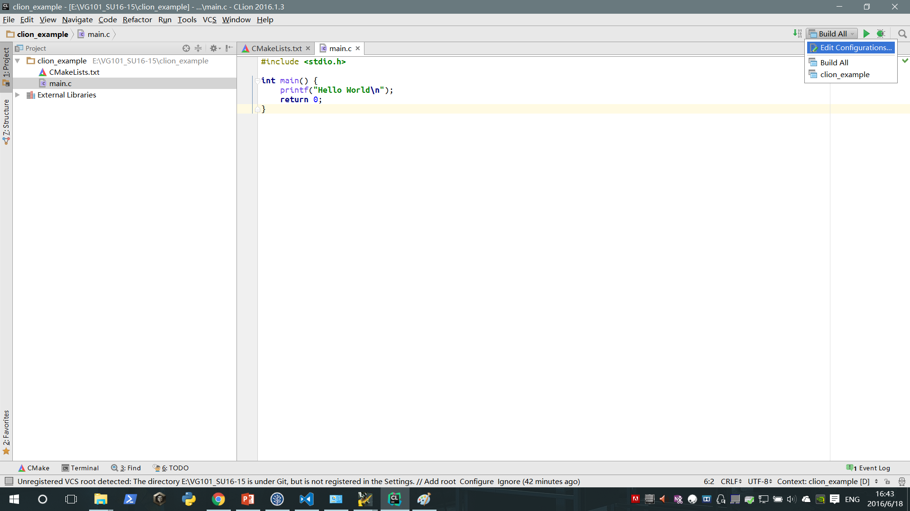
 
  Then input the following 2 things:

  1. Set `Executable` to the only choice. This tells software what to run after compiling.
  2. Set `Working drectory` to the directory of your project. This tells software where to run your code.

  

  Click OK

* RUN, RUN, RUN!
  
  Click the green arrow on the top right coner.
  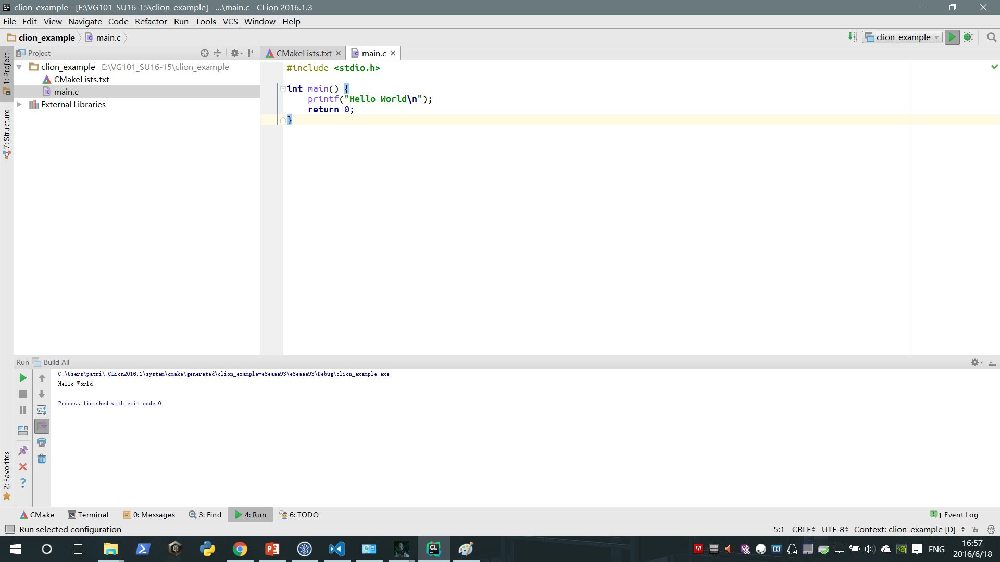

  You will see your program's output in the pop up window on the bottom. 
  If your program requires input from user, you can also type input into the box here. This allows you
  to write, compile and test your code without leaving the software, faster coding.

  If you have written some wrong code, there will be compiler error on it.

  Remember to end the running. Let's say you write an endless loop.
  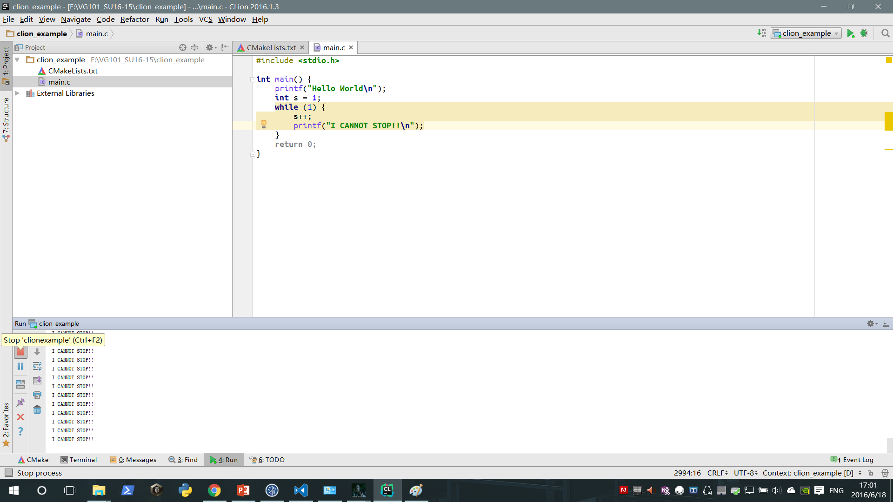
  
  You can click the red button to stop the execution. If you forgot to do that. 
  Since your previous executable is still running, you will not be able to generate a new new
  executable to overwrite the previous one. Then you will get a compiler error.

  Also notice CLion colors the content in while as yellow and the `return 0;` as gray. Yellow means
  warning. If you put your mouse onto the the yellow block on the right edge of the screen. 
  It will say "endless loop". And the gray code are the code that will never get a chance to execute.

  New programmers do accidentally write all sorts of endless loop, or accidentally wrong condition
  statements that some of the code will never get to execute. The software checks it, tries to warn
  you when you are coding this area, when you still remember what you have coded.

  Another common mistake is missing semicolumns "`;`".
  Intentionally write a line without semicolumn, see how the software tell you.

  Just another reason to use CLion.

## Other questions:

* How do I add a header file?

  You do exactly as adding a ".c" file, expect you select "New\C/C++ Header"


