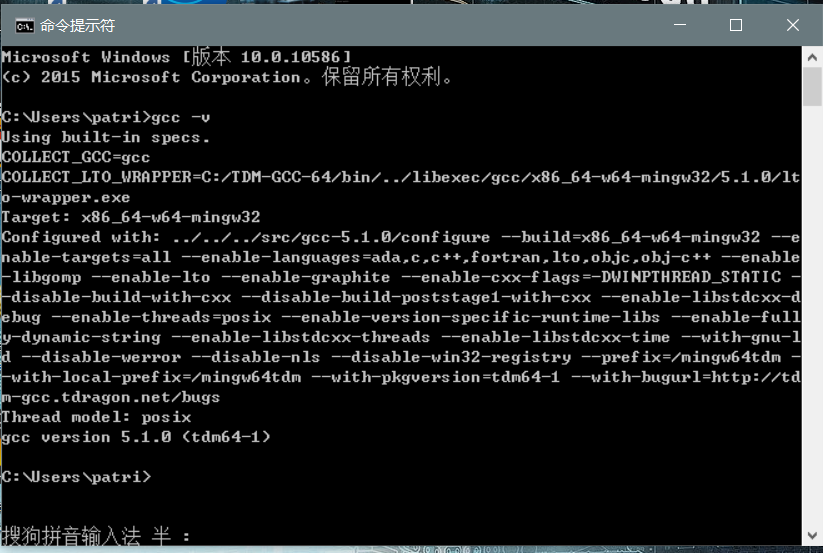
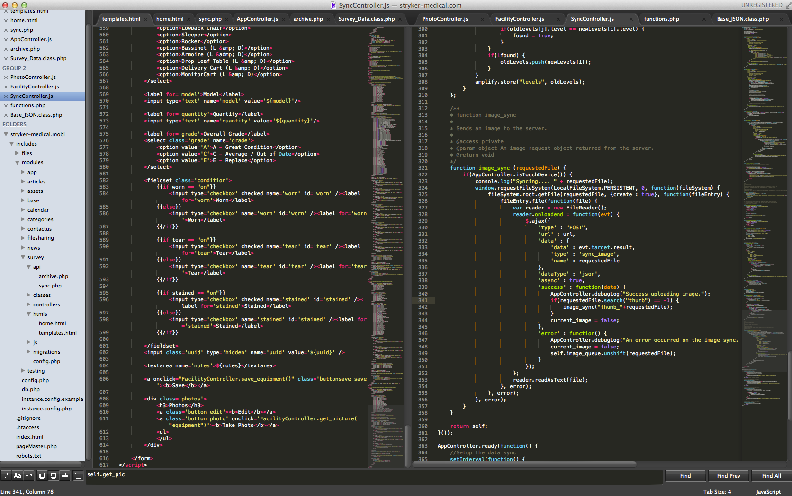
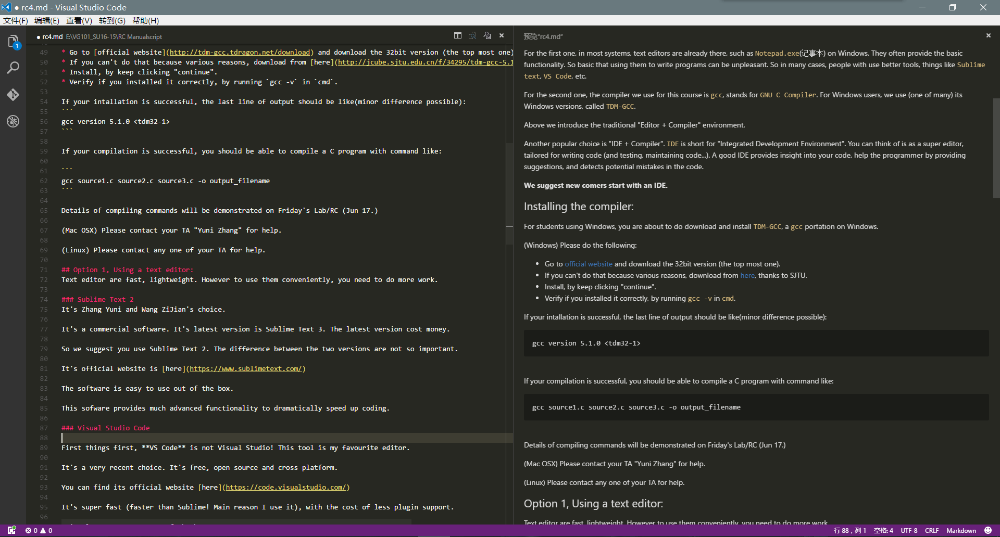
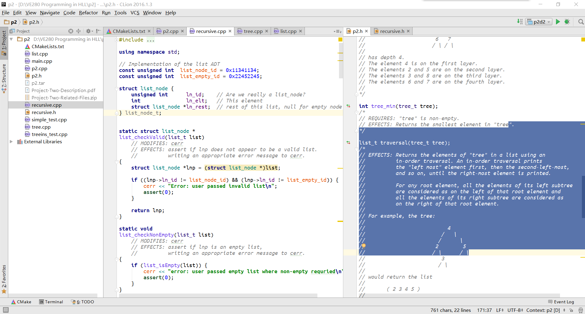
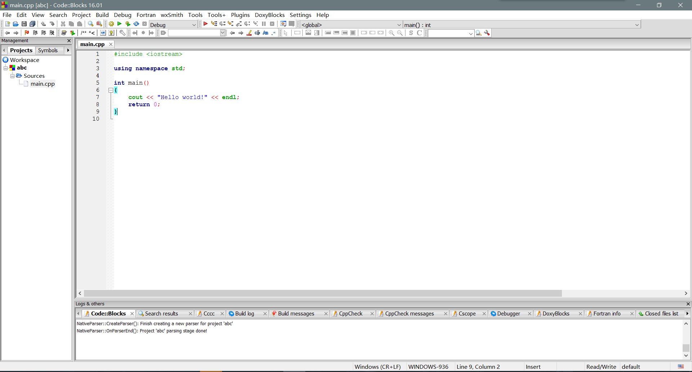

# C/C++ Environment Setup Guide

NOTE: students using Mac OS should go to Yuni for help.

Situation is somewhat complicated due to Apple Inc. :-).

## Background knowledge

Skip the part if you are not interested. 
But these knowledge are essential if you want to understand what you are doing.

Unlike Matlab, C/C++ are compiled language. Meaning their code (code is text) need to be translated (compiled)
into executable files (binary files, just seriers menaningless numbers, at least meaningless for most human).

C/C++ are compiled languages. Meaning, the general way of writing and executing a C program, is

1. Write a C program in a text file (or a collection of files), call this file a "source" file.
2. Use a special program (namely "the C compiler") to translate the into a binary file, this step is "compile".
3. Run this binary file to see results.

You are expected to know these three steps. 

So basically, to set up the C environment is to the following 2 things:

1. You need a text editor to edit text file. 
2. You need a compiler so when you are editing, use it to compile the file.

So you just pick one editor from a bunch of choices, then install the compiler. Then you are good.

For the first one, in most systems, text editors are already there, such as `Notepad.exe`(记事本) on Windows.
They often provide the basic functionality. So basic that using them to write programs can be unpleasant. So
in many cases, people with use better tools, things like `Sublime text`, `VS Code`, etc.

For the second one, the compiler we use for this course is `gcc`, stands for `GNU C Compiler`. For Windows 
users, we use (one of many) its Windows versions, called `TDM-GCC`.

Above we introduce the traditional "Editor + Compiler" environment.

 Another popular choice is "IDE + Compiler". `IDE` is short for "Integrated Development Environment".
 You can think of is as a super editor, tailored for writing code (and testing, maintaining code...).
 A good IDE provides insight into your code, help the programmer by providing suggestions,
and detects potential mistakes in the code. 

**We suggest new comers start with an IDE.**

## Installing the compiler:

For students using Windows, you are about to do download and install `TDM-GCC`, a `gcc` portation on Windows.

(Windows) Please do the following: 

* Go to [official website](http://tdm-gcc.tdragon.net/download) and download the 32bit version (the top most one).
* If you can't do that because various reasons, download from [here](http://jcube.sjtu.edu.cn/f/34295/tdm-gcc-5.1.0-3.exe), thanks to SJTU.
* Install, by keep clicking "continue".
* Verify if you installed it correctly, by running `gcc -v` in `cmd`.

If your intallation is successful, the last line of output should be like(minor difference possible):
```
gcc version 5.1.0 <tdm32-1>

```


If your compilation is successful, you should be able to compile a C program with command like:

``` 
gcc source1.c source2.c source3.c -o output_filename
```

Details of compiling commands will be demonstrated on Friday's Lab/RC (Jun 17.)

**You can include the complie command in your README. Do this especially if your code require special compile command**

Extra note: for studentw who know about "C Standards" (no worry if you don't), this course allow use features from 2011 standard. 

(Mac OSX) Please contact your TA "Yuni Zhang" for help. 

(Linux) Please contact any one of your TA for help.

## Option 1, Using a text editor:
Text editor are fast, lightweight. However to use them conveniently, you need to do more work.

### Sublime Text 2


It's Zhang Yuni and Wang ZiJian's choice. 

It's a commercial software. It's latest version is Sublime Text 3. The latest version cost money.

So we suggest you use Sublime Text 2. The difference between the two versions are not so important.

It's official website is [here](https://www.sublimetext.com/)

The software is easy to use out of the box. 

This sofware provides much advanced functionality to dramatically speed up coding.

### Visual Studio Code


First things first, **VS Code** is not Visual Studio! This tool is my favourite editor.
 
It's a very recent choice. It's free, open source and cross platform.

You can find its official website [here](https://code.visualstudio.com/)

It's super fast (faster than Sublime! Main reason I use it), with the cost of less plugin support.

It's also easy to use out of the box.

### Notepad++ 

On Windows another tool is notepad++. We will not go into that. 

## Option 2, Using an IDE

Due to various reasons.

 **Microsoft Visual Studio is strictly PROHIBITED**

**DO NOT USE MS VISUAL STUDIO**

**DO NOT USE MS VISUAL STUDIO**

**DO NOT USE MS VISUAL STUDIO**

IDEs are heavy weight. They are easy to use out-of the box. However the cost is they are much slower.

### Clion


It's my personal favourite. It'a commercial software from a company called JetBrains.
 Students with SJTU email-address can apply for a free liscense easily.

It is arguably the most powerful IDE at this time. Unlike many other IDEs, it actually tries to understand
your code, other then seeing them as texts. 

Here is its [Official Website](https://www.jetbrains.com/clion/). 
After installing the sofware you will need to inform it where your "gcc" is.
You will need to regester for your JetBrains Account also on the official website for the free lisence.

Note that this IDE also works for Linux and Mac.

After you have installed it, you need to tell it where your `gcc` is installed. Once you tell it the location,
the software will take care of the rest. **Do not use path with Chinese characters** when you set up your
location of your program directory. 

**DO NOT USE PATH WITH CHINESE CHARACTERS!**

Contact us if you don't know how to use the software.

### Code::Blocks


**Attentiion: The IDE comes with its own gcc. No need to install another one**

It is an open-source, cross-platform IDE. Meaning it works on "Windows, Linux, MacOSX".

It was the choice of this course before this semester. 

It's official download page is [here](http://www.codeblocks.org/downloads/26). 

For windows users remember to download the one `codeblocks-16.01mingw-setup.exe`. 
It comes with its own compiler.

## OK? So many choices, how to choose from?

The argument of whether text editors are better then IDE has always been there, 
since the first IDE existed. Some may argue "good programers" always use text editors. 

This is simply not true.

Programmers choose the most suitable tool for thier job. The baseline is, good programmers 
always write good programs, no matter what tool they use.

Using text editors and manually compile it may feel "cool" to some of you. Well, refuse to use better
tools when available is not cool, right?

For starters, we really suggest you start by using IDEs. IDEs really understands your code. Meaning it understands
your code as a piece of code, in contrast to treat it like a bunch of text. The latter is what most text editors does.

The main characteristic between text editors and IDEs are:
* IDEs tends to be slowre.
* IDEs are larger in size.
* IDEs requires some time to get familiar
* IDEs provide better functionality out of the box
 * Meaning it can reduce the amount of memorization, good for starters
 * Meaning it can reduce mistkakes! Another reason good for starters.
* Text editors are fast.
* Text editors are small in size.
* Text editors provides basic functions.
* Text editors require more user work be become handy.
* Text editors are free. More flexibility to change.
